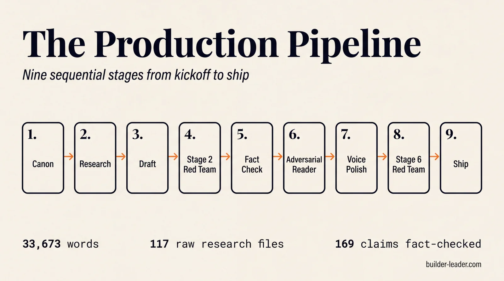

# Builder-Leader

### The AI Exoskeleton That Crosses the Gap

A nonfiction book by **Justin Johnson** on what knowledge work looks like when a senior leader operates through a persistent, multi-agent harness instead of a chat session.

---

## What this repo is

This is the **public showcase** for *Builder-Leader*. Not the book.

It exists to demonstrate three things, and only three things:

1. **The book is rigorous.** Visible production scaffolding (research artifacts, multi-stage critique, fact-check registries, voice polish) shows the work was built carefully, not generated.
2. **The framework is real and reusable.** The Claude Code skills used to draft, critique, fact-check, and ship the manuscript are checked in. Clone them, point them at your own writing.
3. **The book is worth reserving.** The preface is here in full. The remaining ten chapters are gated.

Reserve a copy at **[builder-leader.com](https://builder-leader.com/#preorder-form)** — emails go to the author directly, no newsletter, no spam.

## The production pipeline

Every chapter passed nine sequential stages before it was allowed to be called *ship-ready*.

| Stage | What it does | Per-chapter artifact |
|---|---|---|
| **1 — Canon** | Thesis, outline, audience, voice locked at kickoff. | `canon/` |
| **2 — Research** | Three-tier platform sweep before drafting. Floor: six raw research files per chapter. | `research/<ch>/findings.md` |
| **3 — Draft** | Chapter generated against canon and findings. Post-draft scan for voice violations. | `chapters/NN-<slug>.md` |
| **4 — Stage 2 red team** | Structural and adversarial critique. Weak arguments, unsupported load-bearing claims. | `04_red_team.md` |
| **5 — Fact-check** | Every factual claim extracted, matched to a source, classified. | `01_assertion_registry.md` |
| **6 — Adversarial reader** | Multi-persona reader simulation, including the hostile reviewer the book argues against. | `05_adversarial_reader.md` |
| **7 — Voice polish** | Mechanical scan for banned words, em-dashes, sentence-length monotony, plus per-hit Opus judgment. | `06_voice_polish.md` |
| **8 — Stage 6 red team** | Final rigor gate. Looks specifically for what slipped through six prior passes. | `07_red_team_v2.md` |
| **9 — Ship** | Apply blockers, resolve open questions, advance status, citation re-verify against live sources. | inline + Wayback archive |

See [PRODUCTION-STATS.md](PRODUCTION-STATS.md) for the full numbers (claim counts, citation index, words per chapter, rigor pipeline).

## What's in this repo

| Directory | What's there | What's not |
|---|---|---|
| `chapters/_sample/` | The full preface as a reading sample. | The other 10 chapters. |
| `export/` | Typeset PDF of the preface only. | The full manuscript PDF and EPUB. |
| `.claude/skills/` | Project-local Claude Code skills used to build the book. | — |
| `research/_samples/` | One chapter's full research artifacts (Ch 7 — personal harness building). | The full research corpus. |
| `review-work/_samples/` | One chapter's full nine-stage rigor pipeline + manuscript-wide ship-day summary. | The other ten chapters' rigor artifacts. |
| `planning/_samples/` | One ship-day session log. | All other session logs. |
| `canon/` | A README explaining the canonical spine. | The actual canon files (thesis, outline, audience, voice are reserved). |
| `field-guide/` | Companion exercises for each chapter. Take the fifteen-minute self-audit (`01-two-groups.md`). | — |
| `PRODUCTION-STATS.md` | One page summarizing the whole production. | — |

## Read the preface

- Markdown source: [`chapters/_sample/00-preface.md`](chapters/_sample/00-preface.md)
- Typeset PDF: [`export/preface-sample.pdf`](export/preface-sample.pdf)

## Use the skills

The skills in `.claude/skills/` are project-local Claude Code skills, built and tuned during this book's production. To use them on your own project:

1. Drop the skill directory into your project's `.claude/skills/` folder.
2. Open Claude Code from your project root — the skills are auto-discovered.
3. The general patterns transfer cleanly. The author's specific banned-word lists, canon references, and chapter-slug conventions are sample data — replace with your own.

What they cover: three-tier research sweeps, draft generation grounded in canon, structural and adversarial critique (Stage 2 + Stage 6), fact-check assertion registries, multi-persona reader simulation, mechanical voice polish, manuscript export, audiobook generation.

## Vote on the cover

The book is not yet typeset — there are ten cover candidates in the running. **One voter, drawn at random from those who picked the winning cover, gets a free signed first-edition hardcover when the book ships.** One vote per email.

→ **[Vote at builder-leader.com/vote](https://builder-leader.com/vote)**

## Author

**Justin Johnson** — twelve years building production AI systems for drug discovery and biopharma research. Currently leading an enterprise AI Centre of Excellence in Oncology R&D. Writes [Run Data Run](https://rundatarun.io) (1,000+ subscribers).

- Site: [builder-leader.com](https://builder-leader.com)
- Substack: [Run Data Run](https://rundatarun.io)
- LinkedIn: [justinhaywardjohnson](https://www.linkedin.com/in/justinhaywardjohnson/)
- X: [@bioinfo](https://x.com/bioinfo)

## License

- **Code and skills:** MIT.
- **Sample artifacts and the preface:** CC-BY-NC-ND 4.0 (read, share, attribute; no commercial use, no derivatives).
- **The book itself:** All rights reserved.

See [LICENSE](LICENSE) for full terms.

---

Built through the framework it argues for. The harness is the moat.

